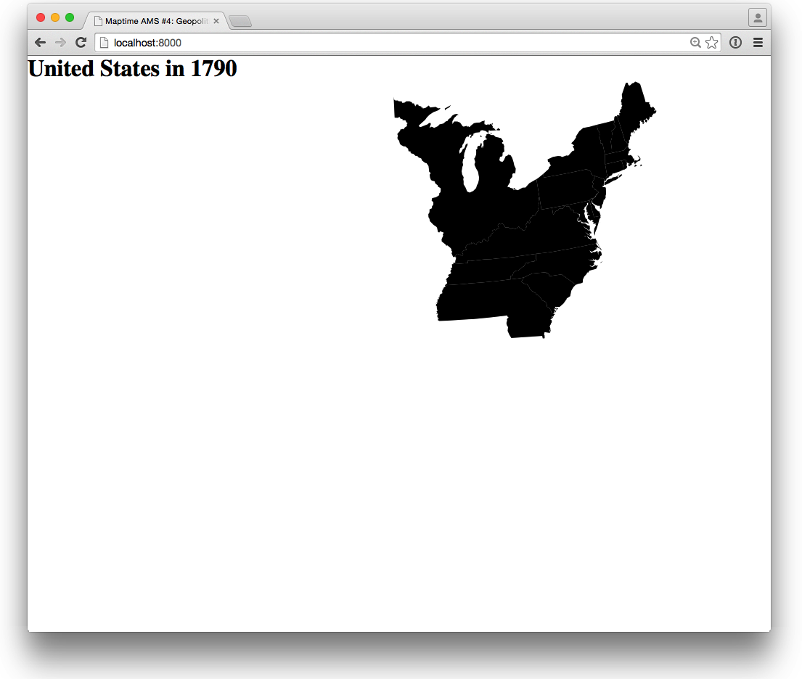
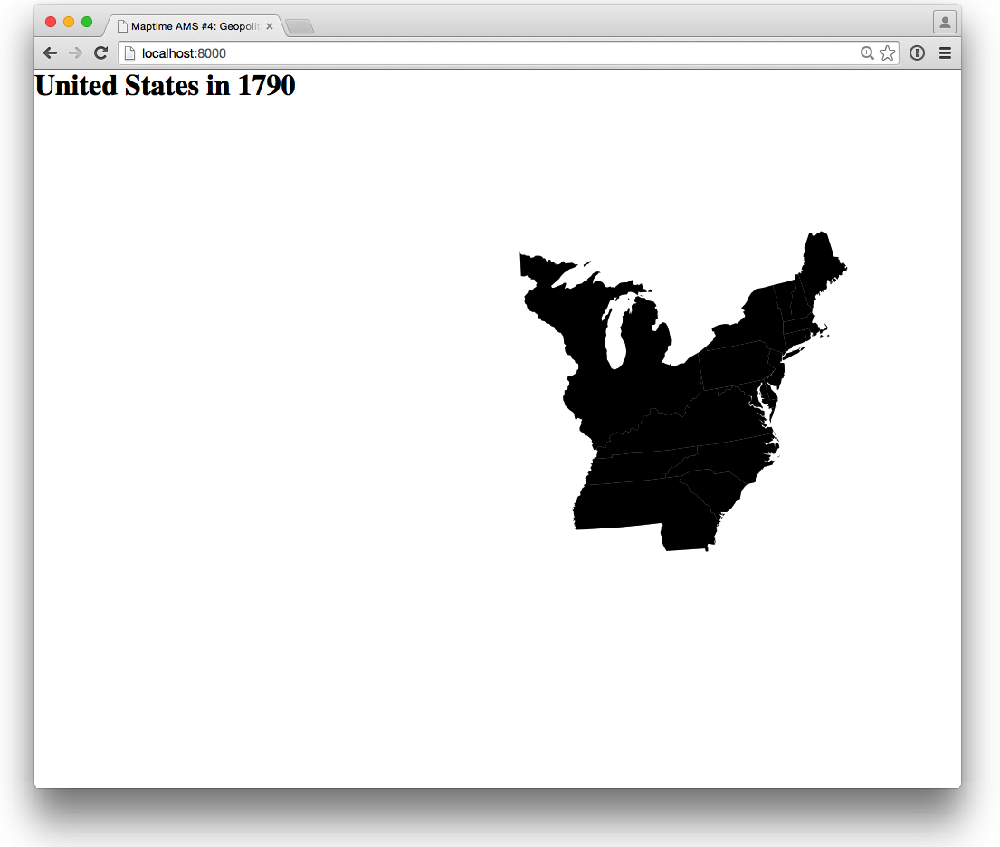
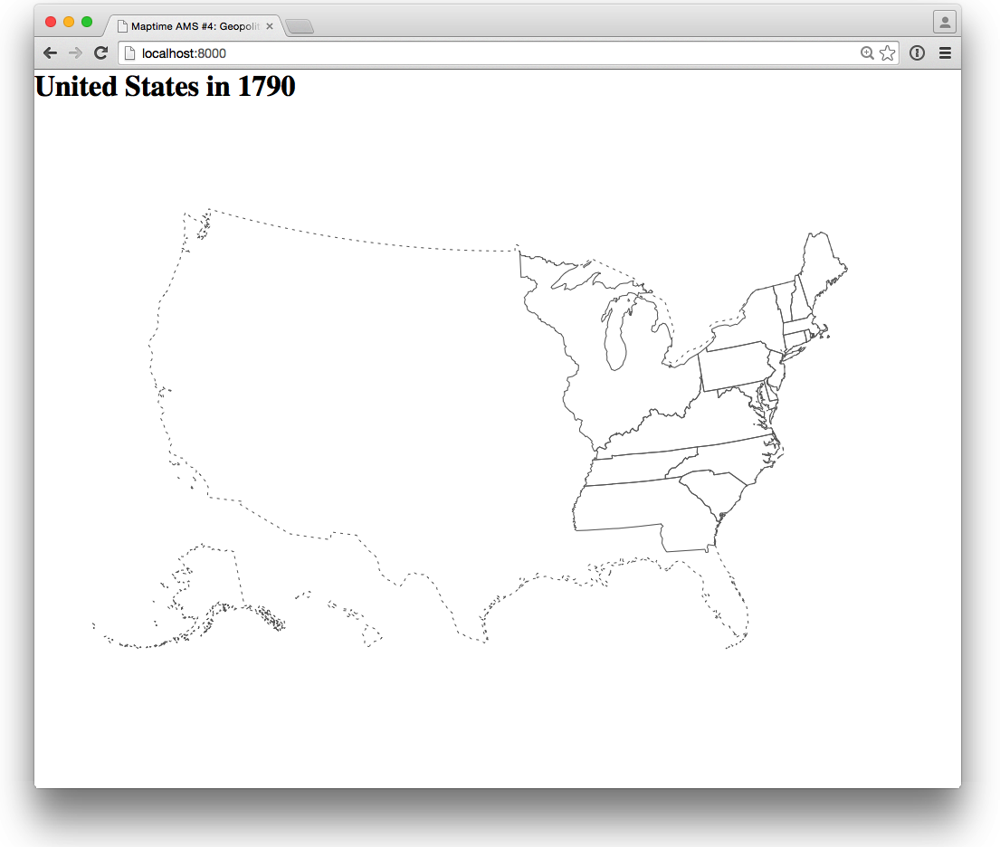
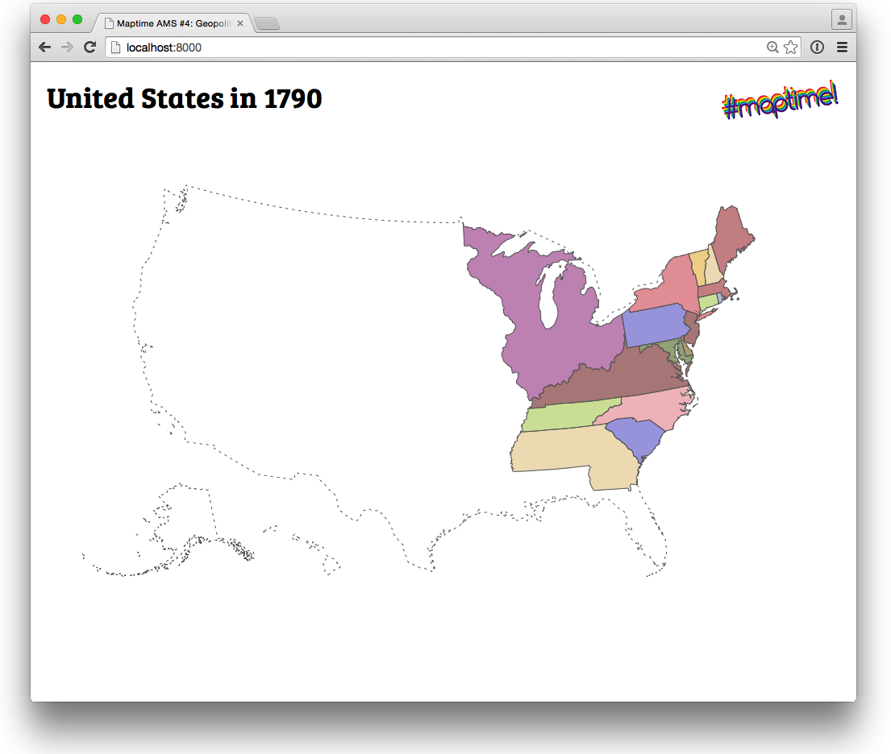
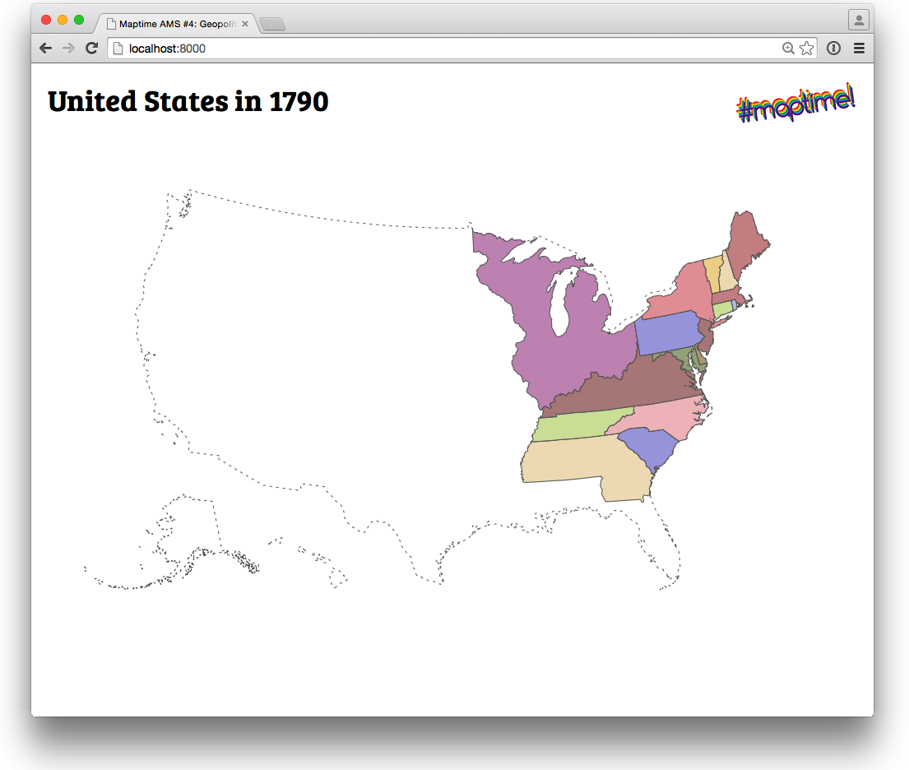

# D3.js - animated U.S. states border map

This is a step-by-step tutorial adapted from a tutorial made for [Maptime Amsterdam](http://maptime-ams.github.io/)'s [fourth Meetup](http://www.meetup.com/Maptime-AMS/events/220184135/), on February 18th, 2015.

We've adapted it slightly to match the versions of libraries we are using in DS 4200 at Northeastern in the Spring of 2020.

We've also shortened the tutorial.  If you'd like to see the original tutorial, you can [view the original github page](https://github.com/maptime-ams/animated-borders-d3js) it was posted on.

When you are finished, please publish to github pages, and post a link to your github pages HERE:

Then, submit a link to your repository on Canvas under the in-class assignment page.

## Let's get started!

First, you should have created a copy of this repository using github classroom.  As with other assignments, open your terminal, clone it, and then navigate inside the directory that was created.

## Step 0: Data

As we talked about in class, generally, to visualize geographic data, you'll have to go through a few steps.

- Download publicly available geography data
- Use command line tools to convert it to TopoJSON data that d3 can use

In this tutorial, we've already done that for you.  However, if you are interested, this section describes how we've done that.

We'll use geo-spatial files containing U.S. state boundaries from the [National Historical Geographic Information System](https://www.nhgis.org/):

> The National Historical Geographic Information System (NHGIS) provides, free of charge, aggregate census data and GIS-compatible boundary files for the United States between 1790 and 2013.

### (Optional) How you can convert the data yourself

_You don't have to download and convert NHGIS data, this tutorial comes with all the data you need. You can just skip this section!_

To download and convert the data needed for this tutorial yourself, follow these steps:

1. Get Shapefiles with state data, per year
  - You can use [the NHGIS Data Finder](https://data2.nhgis.org/main) to select the data you need,
  - Or simply download [`animated-borders-d3js.zip`](https://dl.dropboxusercontent.com/u/12905316/maptime/4/animated-borders-d3js.zip) from Maptime Amsterdam's Dropbox
2. Move/copy the zipped Shapefiles to the data directory (the files should be named `nhgis0001_shapefile_tl2000_us_state_XXXX.zip`)
3. Convert the Shapefiles to [TopoJSON](https://github.com/mbostock/topojson/wiki)!

To do this, you need to install [shp2json](https://github.com/substack/shp2json) and TopoJSON, and you need [Node.js](http://nodejs.org/).

    brew install node
    npm install -g shp2json
    npm install -g topojson

Afterwards, you can convert a Shapefile to TopoJSON by running shp2json and piping its output to TopoJSON:

    shp2json <shapefile> | topojson -p STATENAM -s 1e-6

Or, run `shp2topojson.sh`, a convenient script that comes with this tutorial:

    cd scripts
    ./shp2topojson.sh

### Use data in tutorial's data directory

Done! But you should have a look at the [TopoJSON](https://github.com/mbostock/topojson/wiki) files in the `data` directory, either with your text editor, or [on GitHub](data/1840.json) (GitHub lets you even view GeoJSON files!).

## Step 1: Basic Map

Run a python server and confirm that you have an empty website showing up.

    python -m http.server

In this step, we'll add the D3 and TopoJSON JavaScript libraries, an SVG element, and code to load and display a TopoJSON file.

First, inside the `<head>` element, include two JavaScript libraries:

```html
<script src="http://d3js.org/d3.v4.min.js" charset="utf-8"></script>
<script src="http://d3js.org/topojson.v1.min.js"></script>
```

Also inside the `<head>` element, add some CSS:

```html
<style>
  * {
    margin: 0;
    padding: 0;
  }

  svg {
    position: absolute;
    width: 100%;
    height: 100%;
  }
</style>
```

This CSS defines the web page's _style_, and without it, our map will never be properly displayed.

Then, right _before_ the `<h1>` tag we've added in the previous step, add an SVG element:

```html
<svg>
  <g id="states"></g>
</svg>
```

Now, for some proper JavaScript! Past the following code inside the `renderMap.js` file that is being included in our `index.html` file:

```html
var svgStates = d3.select("svg #states"); // (1)

var projection = d3.geoAlbersUsa(); // (2)

var path = d3.geoPath()
    .projection(projection);  // (3)

d3.json("data/states.json", function(error, topologies) {  // (4)

  var state = topojson.feature(topologies[0], topologies[0].objects.stdin);  // (5)

  svgStates.selectAll("path")  // (6)
      .data(state.features)
      .enter()
    .append("path")
      .attr("d", path);
});
```

Explanation of individual JavaScript lines:

1. Use D3 to select the SVG [group](https://developer.mozilla.org/en-US/docs/Web/SVG/Element/g) with id `#states`.
2. D3 has some map projections built-in. We'll use [Albers USA projection](https://github.com/mbostock/d3/wiki/Geo-Projections#albersUsa), but feel free to experiment with [some of the others](https://github.com/mbostock/d3/wiki/Geo-Projections)!
3. See http://bost.ocks.org/mike/map/ for more information!
4. Load `states.json` (JSON array containing 13 decades of U.S. states)
5. `topojson.feature` will convert a TopoJSON object to a GeoJSON object. We'll start with just the first element in the TopoJSON array (`topologies[0]` = year 1790). I've used the TopoJSON command line utility to convert NHGIS's Shapefiles to TopoJSON, this is why the objects in the JSON file are inside an object called `stdin`...
6. See http://bost.ocks.org/mike/map/ for more information!

OK. Maybe you should just open the results in your browser!

__After this step, your map should look something like this:__

- Screenshot:

[](http://maptime-ams.github.io/animated-borders-d3js/tutorial/3)

## Step 2: Scale & position map in browser's center

Replace the following line:

```js
var projection = d3.geoAlbersUsa(); // (2)
```

With:

```js
var width = window.innerWidth, // (1)
  height = window.innerHeight;
var projection = d3.geoAlbersUsa()
  .translate([width / 2, height / 2]);  // (2)
```

1. Gets the width and height of the browser window
2. Translates the projection, and sets the center halfway the browser's width and height

The map should now be centered nicely in your browser's window!

__After this step, your map should look like this:__

- Screenshot:

[](http://maptime-ams.github.io/animated-borders-d3js/tutorial/4)

## Step 3: Dashed USA coastline

The map will be much easier to read if we would add the U.S. coastline. [Natural Earth](http://www.naturalearthdata.com/) provides a great selection of public domain geo-spatial files, including just the [file we need](data/usa.json).

We don't want the coastline to be too visible, we'll use SVG's [`stroke-dasharray`](https://developer.mozilla.org/en-US/docs/Web/SVG/Attribute/stroke-dasharray) attribute do draw a dashed line. Add the following lines to the page's CSS section:

```css
#boundary path {
  stroke-dasharray: 3 5;
}

path {
  fill: none;
  stroke: black;
}
```

And inside the SVG tag, just before `<g id="states"></g>`, add:

```html
<g id="boundary"></g>
```

To draw the coastline shape in the SVG group we just created, we need D3 to select it. Replace the variable initialization code (the code at the top of `renderMap.js` that defines `svgStates`) with the following lines:

```js
var svgStates = d3.select("svg #states"),
    svgBoundary = d3.select("svg #boundary"),
    states = {},
    startYear = 1790,
    currentYear = startYear;
```

Then, just before we load `states.json`, add the following JavaScript:

```js
d3.json("data/usa.json", function(error, boundary) {
 svgBoundary.selectAll("path")
     .data(boundary.features)
     .enter()
   .append("path")
     .attr("d", path)
});
```

I'm sure that part does not need explaining anymore! Let's have a look at the map!

__After this step, your map should look like this:__

- Screenshot:

[](http://maptime-ams.github.io/animated-borders-d3js/tutorial/8)

## Step 4: Colors, colors, colors!

First our map was black, and later it turned white with a gray outline. Now, it's time for some colors. D3 has [great color scales built in](https://github.com/mbostock/d3/wiki/Ordinal-Scales), but it's not too easy to make sure two neighbouring states do not get the same colors. [Algorithms](http://en.wikipedia.org/wiki/Graph_coloring) which makes sure this won't happen do exist, but it's much easier to manually assign each state with its own color (Mike Bostock does this as well in his [Let’s Make a Map](http://bost.ocks.org/mike/map/) tutorial).

I've created a separate file, [`colors.js`](static/colors.js), which contains a color for each state. I've used colors from the D3 scales, but you should also have a look at [ColorBrewer](http://colorbrewer2.org/).

Include the colors file in your `index.html` ABOVE WHERE YOU INCLUDE THE `renderMap.js` file:

```html
<script src="static/colors.js"></script>
<script src="js/renderMap.js"></script>
```

Finally, add four lines of JavaScript after `.attr("d", path)` in the `renderMap.js` file, where you are rendering the states (and make sure to remove the semicolon on the previous line). The code should look like this:

```js
  svgStates.selectAll("path")  
      .data(state.features)
      .enter()
    .append("path")
      .attr("d", path)
    .style("fill", function(d, i) { 
      console.log("d is ", d)
      var name = d.properties.STATENAM.replace(" Territory", ""); 
      return colors[name]; 
    });

```

1. Sets the `fill` SVG style attribute of each separate state
2. Gets the `STATENAM` property from the GeoJSON object, and removes the string `" Territory"` from the name (that way, we don't have to worry about state names like _Iowa Territory_ but we can use _Iowa_ instead!)
3. Looks up the state name in the colors list

__After this step, your map should look like this:__

- Screenshot:

[](http://maptime-ams.github.io/animated-borders-d3js/tutorial/10)

## Step 5: State name tooltips

It would be great if we could see the names of the states! Luckily, this is easy with the [SVG title element](https://developer.mozilla.org/en-US/docs/Web/SVG/Element/title)!

Add the following code to `renderMap.js` where you are rendering states, after the `style()` function:

```js
.append("svg:title")
  .text(function(d) { return d.properties.STATENAM; });
```

Afterwards, the code should look like this, with the `svg:title` part in the end:

```js
  svgStates.selectAll("path")  
      .data(state.features)
      .enter()
    .append("path")
      .attr("d", path)
    .style("fill", function(d, i) { 
      console.log("d is ", d)
      var name = d.properties.STATENAM.replace(" Territory", ""); 
      return colors[name]; 
    })
    .append("svg:title")
  .text(function(d) { return d.properties.STATENAM; });

```

__After this step, your map should look like this:__

- Screenshot:

[](http://maptime-ams.github.io/animated-borders-d3js/tutorial/11)

You're done!  Great job!  Remember to publish to github pages and to submit a link to your repo to Canvas.
